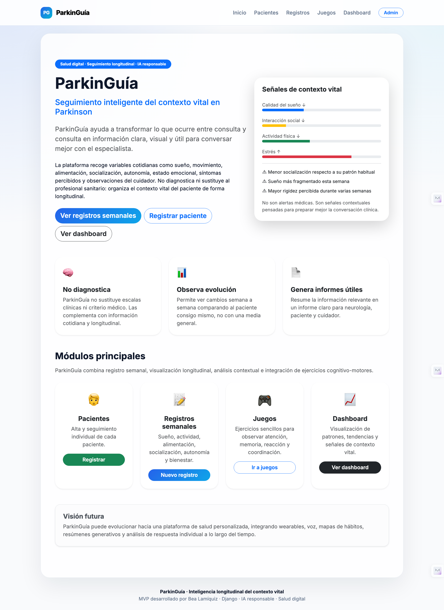
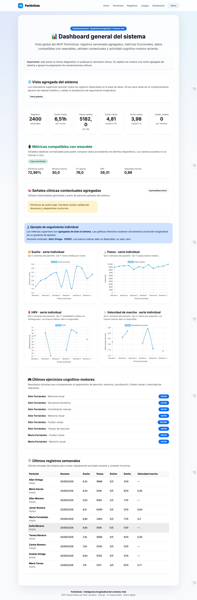
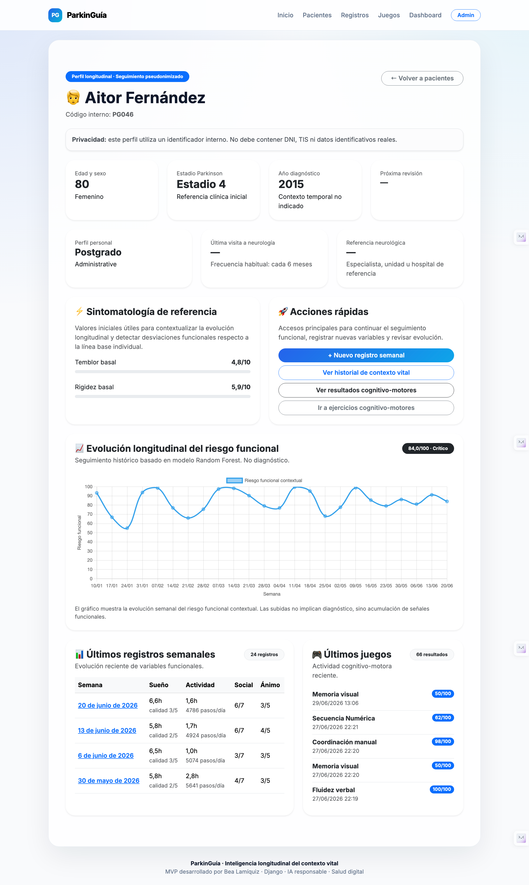
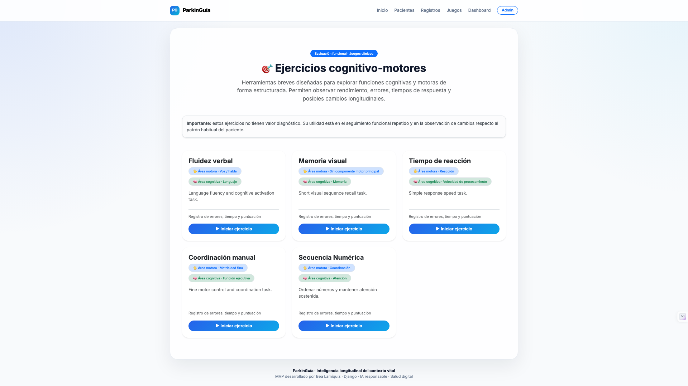
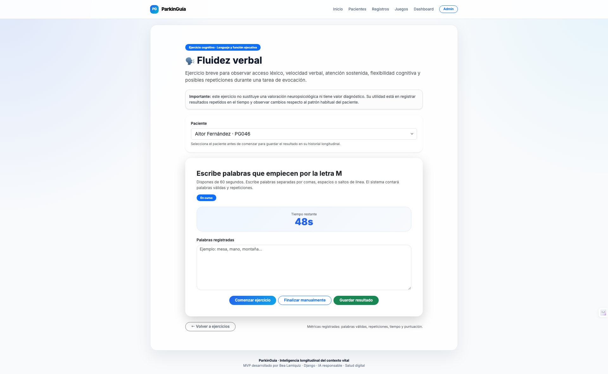
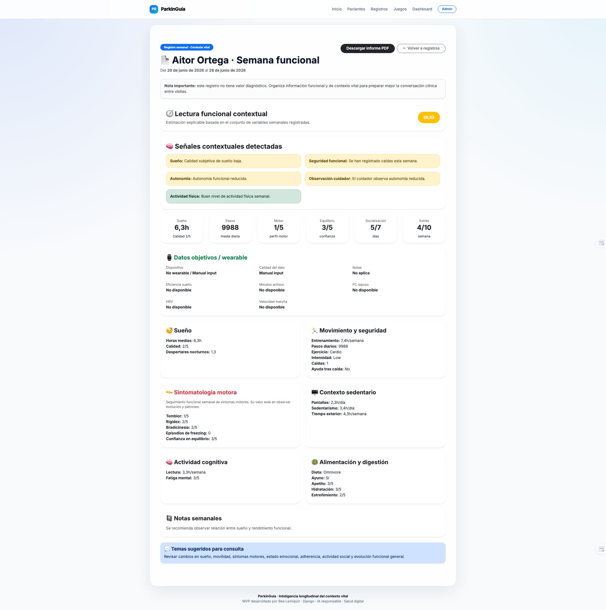

# 🧠 ParkinGuide

### Longitudinal Functional Intelligence for Parkinson’s Disease

**ParkinGuide** is an original **digital health product** designed for **longitudinal functional intelligence**, contextual monitoring, and explainable functional risk analysis in Parkinson’s disease.

Unlike traditional healthcare systems centered on isolated clinical snapshots, ParkinGuide focuses on what happens **between consultations**, transforming real-life motor, emotional, social and cognitive signals into structured longitudinal insights.

It is **not a diagnostic system**.

It does not recommend treatments, adjust medication, or replace healthcare professionals.

Its purpose is to support **better-informed neurological follow-up** through structured longitudinal observation and explainable functional interpretation.

---

# 🌍 Why this matters

Parkinson’s progression is highly heterogeneous.

Two patients with the same diagnosis may evolve in completely different ways.

Population averages are often insufficient to understand functional deterioration.

ParkinGuide follows a **precision longitudinal health** approach:

```text
Each patient is interpreted against:
their own baseline
their own trajectory
their own functional context
```

Not against population averages.

This enables:

> **personalized functional interpretation over time**

---

# 📸 Product Walkthrough

## 🏠 Home

Main product vision and positioning.

Longitudinal intelligence over episodic care.



---

## 📊 Global Dashboard

Population-level contextual monitoring.

Includes:

- functional trends
- contextual signals
- cognitive activity
- wearable-ready variables
- recent clinical activity



---

## 📈 Individual Longitudinal Monitoring — Moderate Risk

Personalized 24-week functional evolution.

Shows baseline-relative progression and contextual changes over time.


---

## 🚨 Individual Longitudinal Monitoring — Critical Risk

Higher-risk progression profile showing accumulated contextual deterioration.



---

## 🎮 Cognitive-Motor Assessment Layer

Integrated mini-games for repeated functional observation.

Used to monitor cognitive speed, motor precision and executive activation.



---

## 🗣️ Verbal Fluency Exercise

Example of a cognitive-motor task used to monitor executive function and language activation longitudinally.



---

## 📄 Weekly Clinical Report

Structured longitudinal PDF reports designed to improve neurologist-patient consultations.



---

# 🎯 Core Product Goal

ParkinGuide is built to:

- record real-world contextual variables
- detect functional deviations over time
- identify deterioration patterns
- reduce information loss between consultations
- improve continuity of care
- generate structured clinical summaries
- support explainable AI in personalized neurological care

---

# 🧩 Core Conceptual Framework

ParkinGuide is built around three complementary intelligence layers.

---

## 1️⃣ Baseline-Relative Modelling

The system compares:

```text
Current patient state
vs
their own historical baseline
```

Never against other patients.

Example:

```text
5,000 steps/day
```

may represent:

- normal stability for one patient
- significant decline for another

This enables:

> **personalized functional interpretation**

---

## 2️⃣ Multi-Source Contextual Observation

ParkinGuide supports:

- patient self-report
- caregiver observation
- combined reporting

This allows comparison between:

```text
perceived function
vs
observed function
```

These discrepancies may become clinically meaningful contextual signals.

---

## 3️⃣ Synthetic Longitudinal Intelligence Layer

Synthetic longitudinal dataset:

```text
100 patients
24 weeks each
2400 weekly records
6000 cognitive-motor results
```

Used to model:

- nonlinear deterioration patterns
- variable interactions
- contextual instability
- habit-response dynamics

This layer enriches patient-level baseline modelling.

---

# 📊 Functional Domains

ParkinGuide monitors **21 weekly functional variables** across four complementary domains.

---

## Motor Domain

Tracks physical and motor performance:

- tremor
- rigidity
- bradykinesia
- freezing
- falls
- balance confidence
- steps
- training hours

---

## Emotional-Functional Domain

Tracks emotional regulation and functional self-perception:

- stress
- mood
- motivation
- autonomy
- mental fatigue

---

## Social-Contextual Domain

Tracks environmental and contextual variables:

- sleep hours
- sleep quality
- night awakenings
- social interactions
- social isolation
- hydration
- constipation

---

## Cognitive-Motor Performance Domain

Measured through integrated mini-games:

- verbal fluency
- reaction time
- memory
- coordination
- executive activation

These allow repeated observation of subtle functional changes over time.

---

# 🎮 Cognitive-Motor Layer

Integrated assessments:

- Visual Memory
- Reaction Time
- Manual Coordination
- Verbal Fluency
- Number Sequence

Used to monitor:

- executive function
- cognitive speed
- motor precision
- memory evolution
- repeated functional patterns

---

# 🧠 Artificial Intelligence Architecture

ParkinGuide integrates two complementary AI systems.

---

## Explainable Contextual Intelligence

Rule-based layer.

Examples:

```text
low sleep + high fatigue
high freezing + low balance confidence
high stress + low activity
```

Produces:

```text
ContextInsight
```

Properties:

- transparent
- explainable
- auditable
- non-diagnostic

---

## Machine Learning Functional Risk Model

Current model:

```text
Random Forest Regressor
```

Predicts:

```text
functional_risk_score (0–100)
```

Why Random Forest:

- nonlinear modeling
- robust with mixed variables
- stable for medium datasets
- interpretable feature importance
- handles interaction effects well

---

# 📈 Current Model Performance

```text
MAE  = 3.59
RMSE = 4.84
R²   = 0.946
```

Top predictors:

1. Balance confidence
2. Sleep hours
3. Freezing episodes
4. Bradykinesia
5. Sleep quality
6. Daily steps
7. Social isolation
8. Mental fatigue

This shows the model is already learning:

> **which variables tend to drive functional deterioration**

---

# 📄 Clinical Workflow

```text
Patient
   ↓
Weekly records
   ↓
Contextual AI
   ↓
Functional risk prediction
   ↓
Longitudinal visualization
   ↓
Clinical PDF report
   ↓
Neurology consultation
```

Outputs:

- contextual summary
- symptom evolution
- functional risk score
- cognitive history
- consultation-ready reports

---

# 🏗️ System Architecture

```text
Patient
   ↓
WeeklyRecord
   ↓
Longitudinal Database
   ↓
Context Engine
   ↓
Random Forest Predictor
   ↓
ContextInsight
   ↓
Longitudinal Visualization
   ↓
Clinical Report
```

---

# 🔐 Privacy by Design

Built with:

- pseudonymized IDs
- no real health identifiers
- explainable AI layers
- transparent logic
- responsible non-diagnostic positioning

Core principles:

- safety
- explainability
- responsibility
- clinical usefulness

---

# ⚙️ Tech Stack

## Backend

- Python
- Django

## Database

- SQLite
- PostgreSQL-ready architecture

## Frontend

- HTML
- CSS
- JavaScript
- Bootstrap

## Visualization

- Chart.js

## AI / Machine Learning

- Pandas
- NumPy
- Scikit-learn

## Reporting

- ReportLab

---

# 🚀 Current MVP Status

## Product

- [x] Longitudinal patient profiles
- [x] Weekly contextual records
- [x] Cognitive-motor tracking
- [x] Functional dashboard
- [x] Clinical PDF reports

## AI

- [x] Synthetic dataset generation
- [x] Functional risk engineering
- [x] Random Forest model
- [x] Real-time prediction
- [x] Context insight generation
- [x] Longitudinal risk visualization

## Next Roadmap

- [ ] Alert engine
- [ ] Wearable synchronization
- [ ] Per-patient explainability
- [ ] AI-generated consultation summaries
- [ ] Habit-response correlation engine

---

# 💡 Value Proposition

ParkinGuide does not aim to diagnose disease.

Its value is more clinically meaningful:

- understand how a patient is evolving
- identify what may be influencing deterioration
- detect which variables matter most
- reduce information loss between consultations
- improve the quality of clinical conversations

That makes it:

> **a functional intelligence layer for longitudinal neurological care**

---

# 👩‍💻 Author

**Bea Lamiquiz**

Backend Developer · Applied AI Product Developer · Digital Health Systems

GitHub:
https://github.com/beatriangu

LinkedIn:
https://www.linkedin.com/in/beatrizlamiquiz

---

# 📌 Final Project

Developed within:

**Laborlan — Artificial Intelligence and Technological Projects**

Focus areas:

- Applied AI
- Product thinking
- Explainable systems
- Precision health
- Longitudinal analytics

---

# 📜 Intellectual Property

ParkinGuide is an original proprietary digital health framework currently under active development.

Its conceptual architecture, longitudinal modelling methodology, contextual intelligence system and functional risk logic are original work by the author.

© 2026 Beatriz Lamiquiz. All rights reserved.
